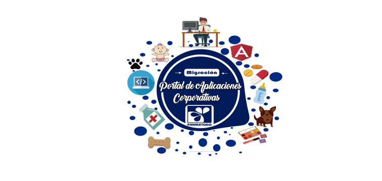
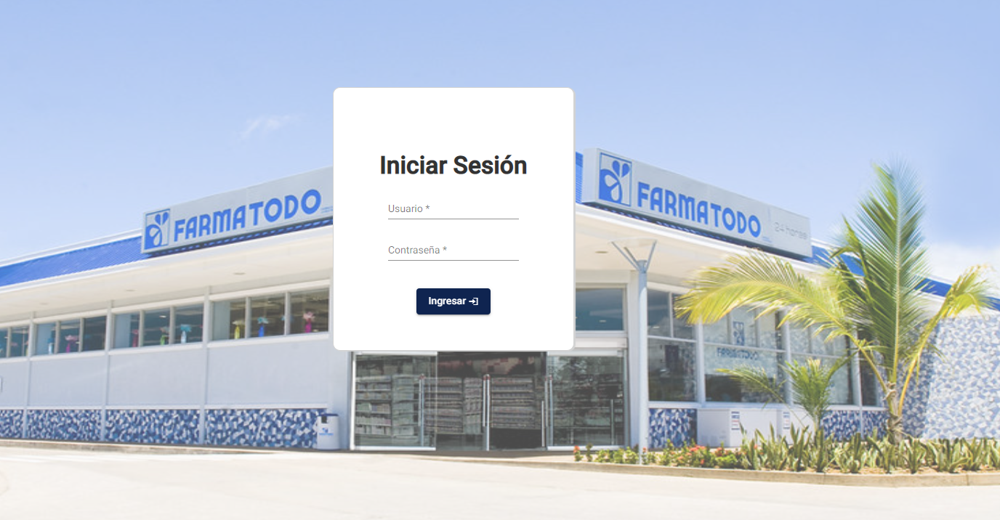
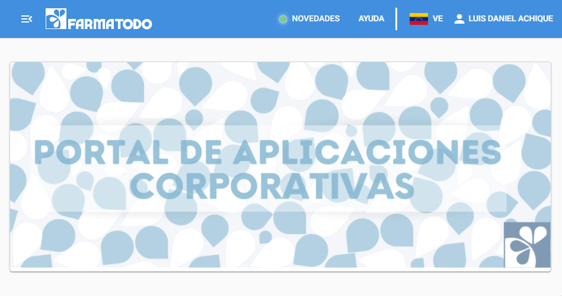
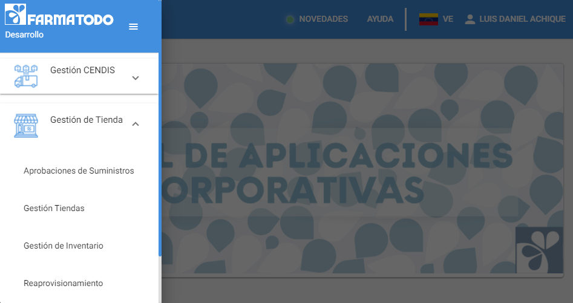
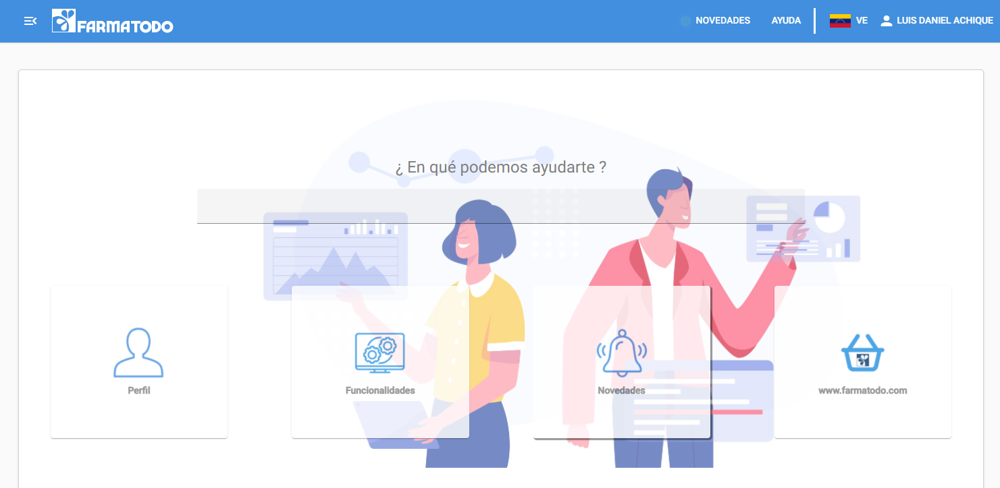
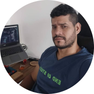

# Farmatodo - Portal de Aplicaciones Corporativas

Migración Frontend ♦️ de Farmatodo - Portal de Aplicaciones Corporativas de Angular JS (v1.6) a Angular v13  🔴
<!--   -->

 

 

## Descripción (Description)📋

Antes que nada, hagamos una aclaración para evitar confusiones. AngularJS y Angular no son lo mismo. No son retrocompatibles

AngularJS es un framework para desarrollo web construido por Google e inicialmente liberado en 2010, conocido como la versión v1 e inferiores. Angular (a secas) conocido como la versión v2 en adelante.

Angular 2 incluye TypeScript, un lenguaje que es un superconjunto de JavaScript que agrega capacidades de tipado estático. Esto nos da la ventaja de poder tipar cosas como variables, funciones, devoluciones, además de poder crear Interfaces. TypeScript también nos da la capacidad de usar enumerators, modules, namespaces, decorators y generics. Y por último pero no por ello menos importante está el sistema de import, que vamos a utilizar a diario para atomizar y modularizar todo nuestro código.

El proyecto consite en la Migración Frontend del Portal de Aplicaciones Corporativas de Angular JS (v1.6) a Angular 2 v13.

## Características(Features) ❤️

Inicio de Sesión (Login)

Home con Sidebar

Dialogs y SnackBar

Perfil de Usuario (Profile)

Loader animación de carga HTTP

**Módulos**

- Seguridad

- Gestión Tiendas

- Gestión CENDIS

- Ayuda

- Novedades

## Herramientas (Tools) 🛠️

Las herramientas utilizadas en el desarrollo del proyecto fueron:

* [Node JS v14 o superior](https://nodejs.org/es/) - Entorno de Ejecución de Servidor para JavaScript

* [Angular v13](https://angular.io/) - Framework Web Frontend para crear SPA (Single Page Aplication).
 
* [Angular Material v13](https://material.angular.io/) - Framework CSS basado en Material Desing para el diseño de interfaz web modernas.

### Equipo (Team) ✒️

A continuación se menciona a todos aquellos que ayudaron a levantar el proyecto desde sus inicios:

* **Andy Cevallos** - *Lider Técnico* - [GitHub: @mrandyron](https://github.com/mrandyron)
  
* **Carlos Rodríguez** - *Lider Técnico*
  
* **Genesis Martinez** - *Diseñadora UI/UX*
  
* **Luis Achique** - *Desarrollador Web Frontend* - [GitHub: @achique-luisdan](https://github.com/achique-luisdan)

## Reseñas (Reviews)
<section align="center">

<a href="https://www.linkedin.com/"><b>Andy Cevallos</b></a>

<b>Ingeniero de Desarrollo de Aplicaciones TI</b>

<b>Farmatodo</b>

</section>
En la organización nace el Proyecto de Migración Portal Aplicaciones Corporativas de AngularJs(1.6) a Angular 13, y con la incorporación de Luis, se ha podido 
llevar con éxito dicha migración, reconociendo su gran aporte en Angular13 con Angular Material, dominando HTML, CSS y JavaScript, aportando conocimientos en buenas practicas como DRY, SOLID, Documentación, entre otras. Excelente recurso para ser integrado en equipos de alto desempeño.
